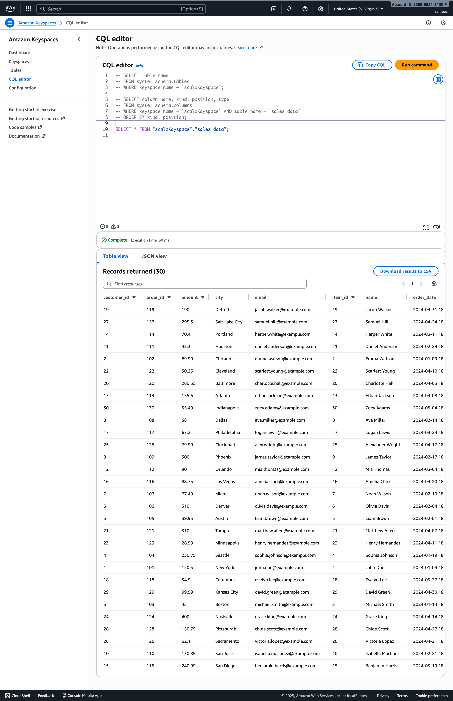

# Pipeline 1 — RDBMS → Spark → Amazon Keyspaces (Cassandra)

---

## **1️ MySQL Input Table Creation SQL**

### **customers**

```sql
CREATE TABLE customers (
  customer_id INT PRIMARY KEY,
  name VARCHAR(100),
  email VARCHAR(100),
  city VARCHAR(100)
);
```

### **orders**

```sql
CREATE TABLE orders (
  order_id INT PRIMARY KEY,
  customer_id INT,
  order_date DATE,
  amount DOUBLE,
  FOREIGN KEY (customer_id) REFERENCES customers(customer_id)
);
```

### **order_items**

```sql
CREATE TABLE order_items (
  item_id INT PRIMARY KEY,
  order_id INT,
  product_name VARCHAR(100),
  quantity INT,
  FOREIGN KEY (order_id) REFERENCES orders(order_id)
);
```

---

## **Amazon Keyspaces Table (CQL)**

```cql
CREATE KEYSPACE scalaKayspace
WITH replication = {
  'class': 'NetworkTopologyStrategy',
  'us-east-1': 3
};

CREATE TABLE retail.sales_data (
  customer_id int,
  order_id int,
  item_id int,
  name text,
  email text,
  city text,
  order_date timestamp,
  amount double,
  product_name text,
  quantity int,
  PRIMARY KEY ((customer_id), order_id, item_id)
) WITH CLUSTERING ORDER BY (order_id ASC, item_id ASC);
```

---

## **Directory Structure for Input Tables (MySQL)**

Not applicable - MySQL stores tables internally.
But representationally:

```
MySQL Database: retail
|
|-- customers
|-- orders
|-- order_items
```

---

## **Directory Structure in Amazon Keyspaces**

Keyspaces is serverless and has no file directory, but logically:

```
Keyspace: scalaKayspace
|
|-- Table: sales_data
    |-- Partition key: customer_id
    |-- Clustering keys: order_id, item_id
```

---

## **Avro Schema for Denormalized Output**

This Avro schema represents the **final dataset written to Amazon Keyspaces**.

```json
{
  "type": "record",
  "name": "sales_data",
  "namespace": "com.scalaKayspace",
  "fields": [
    { "name": "customer_id", "type": "int" },
    { "name": "name", "type": "string" },
    { "name": "email", "type": "string" },
    { "name": "city", "type": "string" },
    { "name": "order_id", "type": "int" },
    { "name": "order_date", "type": ["null", "long"], "logicalType": "timestamp-millis", "default": null },
    { "name": "amount", "type": "double" },
    { "name": "item_id", "type": "int" },
    { "name": "product_name", "type": "string" },
    { "name": "quantity", "type": "int" }
  ]
}
```

---

## **Explanation of Expected Output**

After joins:

### **Final Output Columns**

* `customer_id`
* `name`
* `email`
* `city`
* `order_id`
* `order_date` (converted to timestamp)
* `amount`
* `item_id`
* `product_name`
* `quantity`

### **Example Output Row**

| customer_id | name     | email                                       | city     | order_id | order_date       | amount | item_id | product_name  | quantity |
| ----------- | -------- | ------------------------------------------- | -------- | -------- | ---------------- | ------ | ------- | ------------- | -------- |
| 1           | John Doe | [john@example.com](mailto:john@example.com) | New York | 101      | 2024-01-05 00:00 | 120.50 | 1       | Laptop Sleeve | 1        |

### **Why this design?**

* Keyspaces partitions by **customer_id** for fast user-level lookups.
* Clustering by **order_id, item_id** keeps order history sorted.
* Supports queries such as:

```cql
SELECT * FROM scalaKayspace.sales_data WHERE customer_id = 1;
```

### **Use Case**

A downstream analytics job can instantly retrieve:

* All orders by a customer
* Items within each order
* Order timeline and spending patterns

