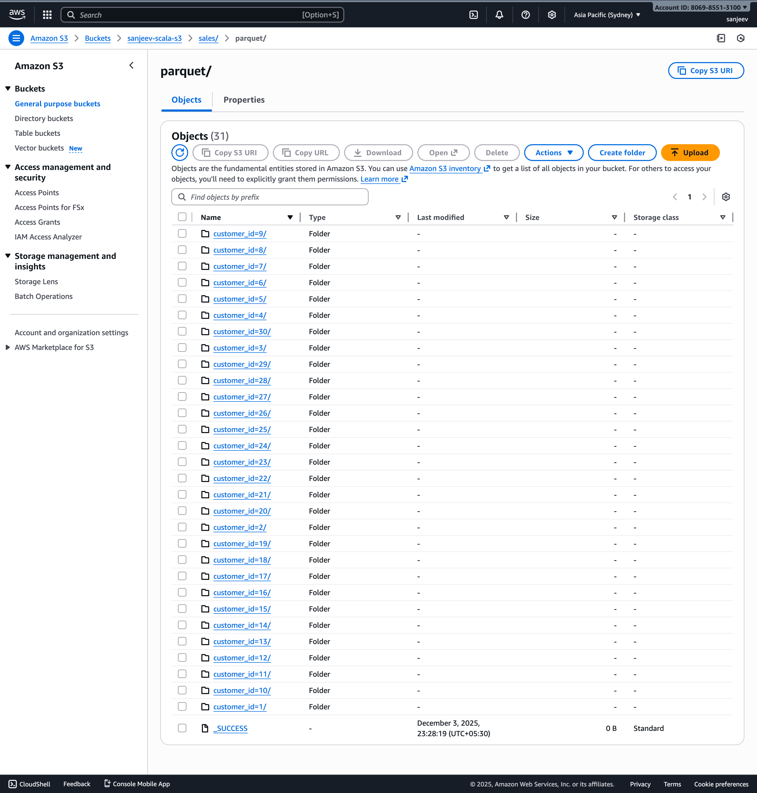
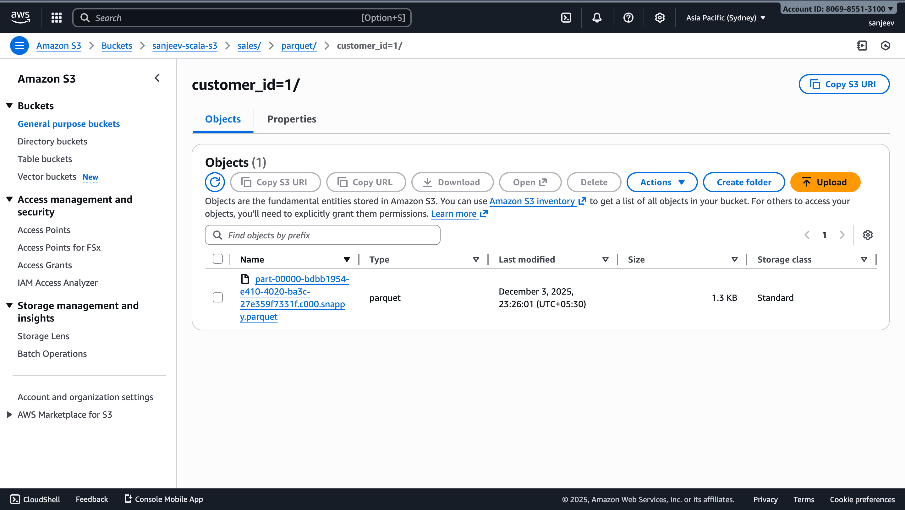

# Pipeline 2 — Read Keyspaces → Parquet on S3

---

## 1. Keyspaces table CQL (source)

```cql
-- Keyspace (if not present)
CREATE KEYSPACE IF NOT EXISTS scalaKayspace
WITH replication = {'class': 'NetworkTopologyStrategy', 'us-east-1': 3};

-- Source table (sales_data) in Amazon Keyspaces
CREATE TABLE IF NOT EXISTS scalaKayspace.sales_data (
  customer_id int,
  order_id int,
  item_id int,
  name text,
  email text,
  city text,
  order_date timestamp,
  amount double,
  product_name text,
  quantity int,
  PRIMARY KEY ((customer_id), order_id, item_id)
) WITH CLUSTERING ORDER BY (order_id ASC, item_id ASC);
```

---

## 2. Directory structure in S3 (output — partitioned by `customer_id`)

S3 root (example): `s3://sanjeev-scala-s3/sales/parquet/`

Partitioned layout produced by Spark `partitionBy("customer_id")`:

```
s3://sanjeev-scala-s3/sales/parquet/
├─ _SUCCESS
├─ customer_id=1/
│  ├─ part-00000-...-c000.parquet
│  └─ ...
├─ customer_id=2/
│  ├─ part-00000-...-c000.parquet
│  └─ ...
└─ customer_id=3/
   ├─ ...
```

Notes:

* Each `customer_id=XYZ/` folder contains one or more Parquet part files plus metadata.
* Parquet files are splittable and compressed (Spark defaults to Snappy if available).

---

## 3. Avro schema for the selected output columns

This schema represents the data model of the dataset written to S3 (selected fields only):

```json
{
  "type": "record",
  "name": "SalesSelected",
  "namespace": "com.scalaKayspace",
  "fields": [
    { "name": "customer_id", "type": "int" },
    { "name": "order_id", "type": "int" },
    { "name": "amount", "type": "double" },
    { "name": "product_name", "type": ["null", "string"], "default": null },
    { "name": "quantity", "type": ["null", "int"], "default": null }
  ]
}
```

---

## 4. Explanation of expected output

**What the pipeline produces**

* Reads `scalaKayspace.sales_data` from Amazon Keyspaces.
* Selects the columns: `customer_id, order_id, amount, product_name, quantity`.
* Writes them to S3 as **Parquet** files partitioned by `customer_id`.

**Why partition by `customer_id`**

* Efficient queries that filter by customer (minimizes data scanned).
* Logical grouping of a customer's orders and items into one directory.

**Output characteristics**

* Format: Parquet (columnar, supports predicate pushdown).
* Partitioning: one directory per `customer_id`, e.g., `customer_id=123/`.
* Files: part files (`part-*.parquet`) inside each partition; Spark-generated `_SUCCESS` and metadata files at root.
* Compression: typical defaults are used (Snappy) unless overridden.

**Typical downstream queries/use-cases**

* Per-customer analytics: `SUM(amount)` or `COUNT(order_id)` filtered by `customer_id`.
* Per-order item listing: read partition for `customer_id` and filter by `order_id`.
* Consumption by Athena, Glue, Redshift Spectrum, Spark, or any Parquet-capable engine.



