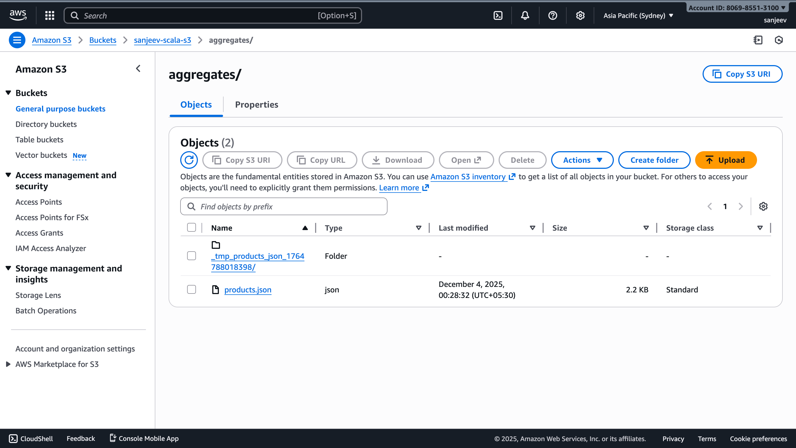

# Pipeline 3 – Read Parquet → Aggregate → Write JSON

**Goal:**  
Read partitioned Parquet sales data from S3, compute per-product aggregates, and write a **single JSON file** with total quantity and revenue per product back to S3.

---

## 1. Spark Job (Scala) – High-Level Design

**Class:** `pipeline3.ParquetToProductAggregates`

**Responsibilities:**

1. **Read Parquet from S3**  
   - Input path (from `application.conf`):  
     ```hocon
     app {
       parquetPath     = "s3a://sanjeev-scala-s3/sales/parquet/"
       aggregatesPath  = "s3a://sanjeev-scala-s3/aggregates/"
     }
     ```
   - The Parquet dataset is assumed to come from **Pipeline 2**, with columns:

     ```text
     customer_id:   INT
     order_id:      INT
     amount:        DOUBLE
     product_name:  STRING
     quantity:      INT
     ```

2. **Compute per-product aggregates**

   Using Spark DataFrame API:

   - Group by `product_name`
   - Compute:
     - `total_quantity = SUM(quantity)`
     - `total_revenue  = SUM(amount)`
   - Round `total_revenue` to 2 decimal places
   - Order products by `total_revenue` descending

3. **Write as a single JSON file to S3**

   Implementation strategy:

   - Coalesce the aggregated DataFrame to a single partition:
     ```scala
     agg.coalesce(1).write.mode("overwrite").json(tmpOutput)
     ```
   - Spark will write something like:
     `s3a://sanjeev-scala-s3/aggregates/_tmp_products_json_<ts>/part-00000-...json`
   - Use Hadoop `FileSystem` to:
     - Locate `part-*.json` under the temporary directory
     - Rename it to the final location:
       ```text
       s3a://sanjeev-scala-s3/aggregates/products.json
       ```
     - Delete the temporary folder

4. **S3 Configuration**

   - Uses `fs.s3a` with simple access key / secret key:
     ```hocon
     keyspaces {
       accesskey = "YOUR_ACCESS_KEY"
       secretkey = "YOUR_SECRET_KEY"
       region    = "ap-south-1"
       endpoint  = "s3.ap-south-1.amazonaws.com"
     }
     ```
   - These values are injected into:
     - `spark.hadoop.fs.s3a.access.key`
     - `spark.hadoop.fs.s3a.secret.key`
     - `spark.hadoop.fs.s3a.region` / `spark.hadoop.fs.s3a.endpoint`
     - `fs.s3a.aws.credentials.provider = org.apache.hadoop.fs.s3a.SimpleAWSCredentialsProvider`

---

## 2. Input Table Creation SQL (RDBMS)

Although **Pipeline 3** reads from Parquet, that Parquet is produced from a denormalized structure with fields:

- `product_name`
- `quantity`
- `amount`
- `customer_id`
- `order_id`

If you want an RDBMS table mirroring the **denormalized sales facts** that feed the Parquet, you can use:

```sql
CREATE TABLE sales_facts (
    customer_id   INT          NOT NULL,
    order_id      INT          NOT NULL,
    product_name  VARCHAR(255) NOT NULL,
    quantity      INT          NOT NULL,
    amount        DOUBLE       NOT NULL,
    PRIMARY KEY (order_id, product_name)
);
````

This table aligns with the columns typically written into Parquet by Pipeline 2.

> Note: In your actual setup, Pipeline 1 used **customers**, **orders**, and **order_items** tables; those joins produced the dataset that was written to Amazon Keyspaces and then exported to Parquet. `sales_facts` is just a convenient logical view / staging table representation.

---

## 3. Keyspaces Table CQL

The Parquet input for this pipeline is assumed to originate from an Amazon Keyspaces table like this:

```sql
CREATE TABLE IF NOT EXISTS kayspace.sales_data (
    customer_id   int,
    order_id      int,
    item_id       int,
    product_name  varchar,
    quantity      int,
    amount        double,
    order_date    timestamp,
    email         varchar,
    name          varchar,
    city          varchar,
    PRIMARY KEY ((customer_id), order_id, item_id)
) WITH CLUSTERING ORDER BY (order_id ASC, item_id ASC);
```

Typical export flow:

1. Pipeline 1: MySQL → Spark → **Keyspaces** (`scalaKayspace.sales_data`)
2. Pipeline 2: Keyspaces → Spark → **Parquet** on S3 (`s3a://sanjeev-scala-s3/sales/parquet/`)
3. Pipeline 3 (this job): Parquet → aggregations → **JSON** on S3

---

## 4. Directory Structure in S3

### 4.1 Parquet Input (from Pipeline 2)

```text
s3://sanjeev-scala-s3/
└── sales/
    └── parquet/
        ├── part-00000-....snappy.parquet
        ├── part-00001-....snappy.parquet
        ├── ...
        └── _SUCCESS
```

* The dataset may be partitioned by `customer_id` (depending on Pipeline 2):

  ```text
  s3://sanjeev-scala-s3/sales/parquet/
    ├── customer_id=101/part-00000-...
    ├── customer_id=102/part-00001-...
    └── ...
  ```

### 4.2 Aggregated JSON Output (from this Pipeline 3)

```text
s3://sanjeev-scala-s3/
└── aggregates/
    ├── products.json          # <-- final single JSON file
    └── (temporary folders used during job run, cleaned up)
```

* Config in `application.conf`:

  ```hocon
  app {
    parquetPath    = "s3a://sanjeev-scala-s3/sales/parquet/"
    aggregatesPath = "s3a://sanjeev-scala-s3/aggregates/"
  }
  ```

* The job writes to a temporary directory under `aggregatesPath`, then moves `part-*.json` to:

  ```text
  s3a://sanjeev-scala-s3/aggregates/products.json
  ```

## 5. Explanation of Expected Output

After running **`ParquetToProductAggregates`**, you should get:

1. **A single JSON file** at:

   ```text
   s3://retail-output/aggregates/products.json
   ```

2. Each JSON line (record) represents one product:

   Example content:

   ```json
   {
     "product_name": "Laptop Pro 15",
     "total_quantity": 42,
     "total_revenue": 756000.50
   }
   {
     "product_name": "Wireless Mouse",
     "total_quantity": 320,
     "total_revenue": 25600.00
   }
   {
     "product_name": "USB-C Cable",
     "total_quantity": 580,
     "total_revenue": 8700.75
   }
   ```

3. **Ordering:**

    * Records are ordered by `total_revenue` in descending order.
    * Top revenue products appear first in the file.

4. **Usage:**

    * This JSON file can be:

        * Loaded into BI tools for product performance dashboards.
        * Used by downstream jobs (e.g., top-N product recommendation, revenue analysis).
        * Imported into another system (e.g., search index, data warehouse).

