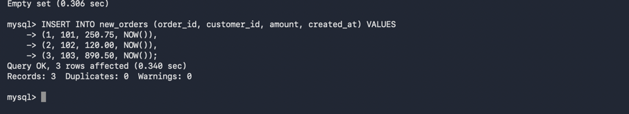
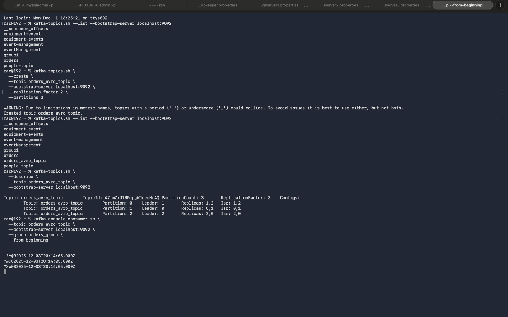
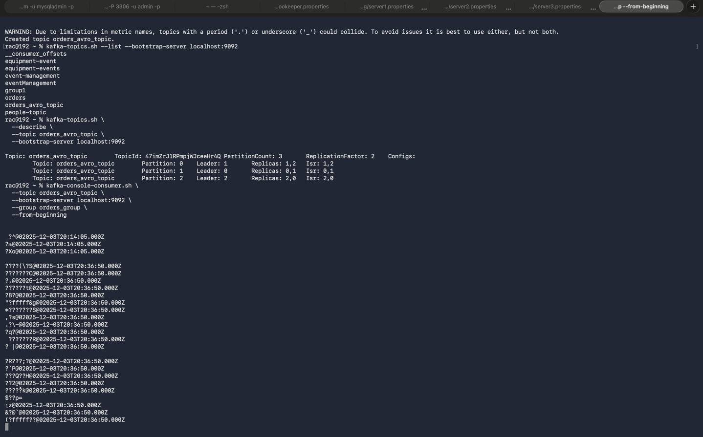

# Pipeline 4 — Spark Structured Streaming → MySQL Polling → Kafka (Avro)

This pipeline continuously polls a MySQL table for newly inserted records, encodes those records in **Avro**, and publishes them to a Kafka topic.  
It uses manual offset tracking stored in MySQL to guarantee exactly-once delivery.

---

# 1. Spark Code (Scala) – Summary

**Class:** `pipeline4.MySQLToKafkaAvroStream`  
(Scala code already provided in the user’s snippet)

### Purpose:
- Poll MySQL every N seconds (`pollIntervalSec`)
- Read newly added `order_id` rows from table **new_orders**
- Convert the records to Avro format using explicit schema
- Produce to Kafka topic **orders_avro_topic**
- Store offsets in MySQL table **streaming_offsets** to avoid duplicates

### Key Steps Performed in Code:
1. **Dummy streaming source:**  
   ```scala
   spark.readStream.format("rate")
    ````

Used only to trigger micro-batches.

2. **Offset tracking:**
   Stored in MySQL table:

    * Read last processed `order_id`
    * Select rows where `order_id > last_offset`
    * After writing to Kafka, update offset

3. **Avro Encoding:**
   Uses:

   ```scala
   to_avro(struct(...), avroSchemaJson)
   ```

4. **Kafka Write:**
   Writes:

    * `key = order_id`
    * `value = Avro binary`

---

# 2. Input Table Creation SQL (MySQL)

### **new_orders**

Your streaming input table:

```sql
CREATE TABLE IF NOT EXISTS new_orders (
    order_id     INT PRIMARY KEY,
    customer_id  INT NOT NULL,
    amount       DOUBLE NOT NULL,
    created_at   TIMESTAMP NOT NULL DEFAULT CURRENT_TIMESTAMP
);
```

### Sample Inserts:

```sql
INSERT INTO new_orders (order_id, customer_id, amount, created_at) VALUES
(1, 101, 250.75, NOW()),
(2, 102, 120.00, NOW()),
(3, 103, 890.50, NOW()),
(4, 104, 99.99, NOW()),
(5, 105, 450.00, NOW()),
(6, 106, 1299.00, NOW()),
(7, 107, 15.75, NOW()),
(8, 108, 79.50, NOW()),
(9, 109, 400.10, NOW()),
(10, 110, 150.00, NOW());
```

---

# 3. Offset Table Creation SQL (MySQL)

```sql
CREATE TABLE IF NOT EXISTS streaming_offsets (
    source         VARCHAR(128) NOT NULL PRIMARY KEY,
    last_order_id  BIGINT NOT NULL
);
```

The job inserts/updates:

```sql
(source = 'new_orders', last_order_id = X)
```

---

# 4. Directory Structure in S3

*Pipeline 4 does NOT write to S3.*

The output is Kafka topic **orders_avro_topic**.
Downstream Pipeline 5 will write JSON to S3.

Still, we provide the expected structure for downstream:

```
s3://sanjeev-scala-s3/
└── stream/
    └── json/
        ├── part-00000-xxx.json
        ├── part-00001-xxx.json
        └── _SUCCESS
```

---

# 5. Avro Schema (orders.avsc)

```json
{
  "type": "record",
  "name": "OrderRecord",
  "namespace": "com.retail",
  "fields": [
    { "name": "order_id", "type": "int" },
    { "name": "customer_id", "type": "int" },
    { "name": "amount", "type": "double" },
    { "name": "created_at", "type": "string" }
  ]
}
```

This schema is embedded as `avroSchemaJson` inside your Scala code.

---

# 6. Explanation of Expected Output

### What the pipeline does:

1. Reads **only new rows** from `new_orders`
2. Converts each row to an Avro record:

   ```json
   {
     "order_id": 1,
     "customer_id": 101,
     "amount": 250.75,
     "created_at": "2025-01-02T10:15:22.123Z"
   }
   ```
3. The Avro record is published to Kafka:

* **Topic**: `orders_avro_topic`
* **Key**: `order_id`
* **Value**: Avro binary (encoded)

### How consumers will see the message:

When decoded, Kafka consumers receive:

```json
{
  "order_id": 5,
  "customer_id": 105,
  "amount": 450.00,
  "created_at": "2025-12-04T10:30:45.200Z"
}
```

### Offset tracking behavior:

* If the highest order_id processed is **10**
* A new record with `order_id = 11` is inserted
* Next batch will pick up only:

  ```sql
  SELECT * FROM new_orders WHERE order_id > 10;
  ```



