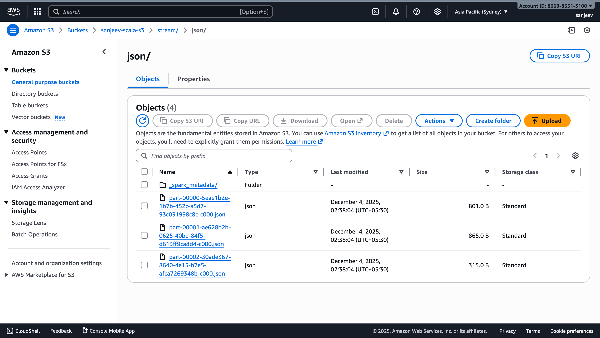
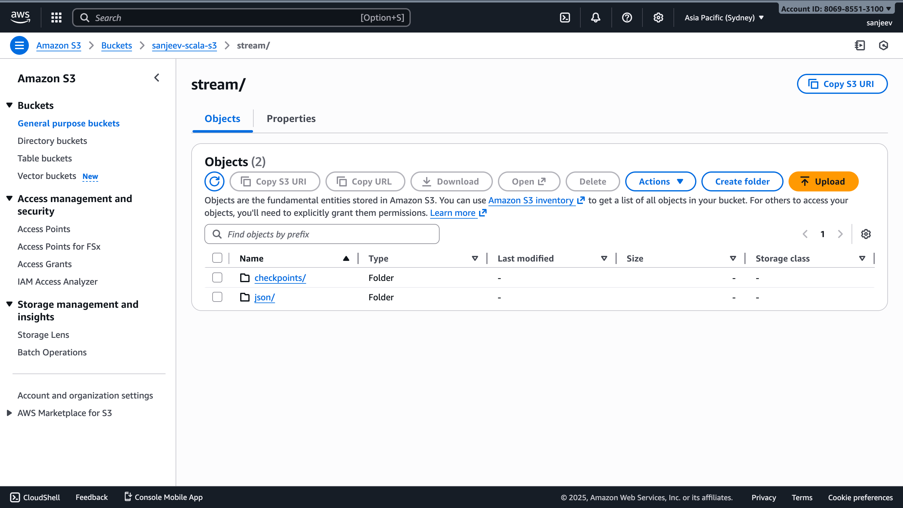
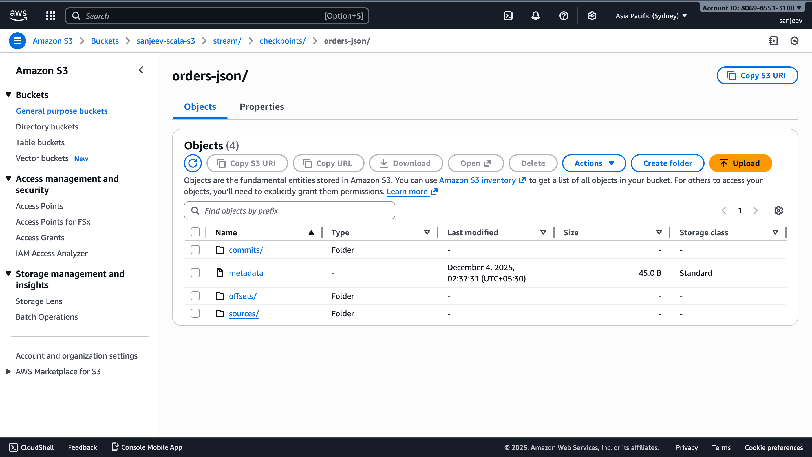

# Pipeline 5 — Kafka Consumer (Avro) → JSON → S3  

---

# **Pipeline 5 Overview**
This pipeline reads **Avro-encoded messages from Kafka**, decodes them using `from_avro`, converts the result to **JSON**, and stores them in **Amazon S3**.

---

# 1. Input Table Creation SQL (Upstream — Pipeline 4)

Pipeline 5 reads Kafka messages that originate from **pipeline4**’s MySQL table.

```sql
CREATE TABLE IF NOT EXISTS new_orders (
    order_id     INT PRIMARY KEY,
    customer_id  INT NOT NULL,
    amount       DOUBLE NOT NULL,
    created_at   TIMESTAMP NOT NULL DEFAULT CURRENT_TIMESTAMP
);
```

Sample data used in pipeline 4:

```sql
INSERT INTO new_orders (order_id, customer_id, amount, created_at) VALUES
(1, 101, 250.75, NOW()),
(2, 102, 120.00, NOW()),
(3, 103, 890.50, NOW());
```

Pipeline 5 **does not use SQL directly**, but depends on these messages.

---

# 2. Expected Directory Structure in S3

Assuming:

```
app.streamJsonOutputPath = "s3a://sanjeev-scala-s3/stream/json/"
app.streamCheckPointsOutputPath = "s3a://sanjeev-scala-s3/stream/checkpoints/orders-json/"
```

### Final S3 structure:

```
s3://sanjeev-scala-s3/
└── stream/
    ├── json/
    │   ├── part-00000-xxxx.json
    │   ├── part-00001-xxxx.json
    │   └── ...
    └── checkpoints/
        └── orders-json/
            ├── offsets/
            ├── commits/
            ├── metadata
            └── ...
```

Spark will generate multiple small JSON files.
Each record becomes:

```json
{"order_id":1,"customer_id":101,"amount":250.75,"created_at":"2025-01-01T10:22:33.100Z"}
```

---

# 3. Avro Schema (Used for Decoding)

```json
{
  "type": "record",
  "name": "OrderRecord",
  "namespace": "com.retail",
  "fields": [
    { "name": "order_id", "type": "int" },
    { "name": "customer_id", "type": "int" },
    { "name": "amount", "type": "double" },
    { "name": "created_at", "type": "string" }
  ]
}
```

---

# 4. Explanation of Expected Output

### What the pipeline receives

Kafka messages published by Pipeline 4:

* **Key:** order_id
* **Value:** Avro binary encoded using schema above

Example Kafka message:

```
Key = "5"
Value = <Avro binary>
```

### What the pipeline writes to S3

Spark decodes Avro → struct, then struct → JSON.

### Final JSON Output:

```json
{
  "order_id": 5,
  "customer_id": 107,
  "amount": 79.50,
  "created_at": "2025-12-04T10:35:22.123Z"
}
```

Each micro-batch writes a new `part-xxxxx.json` file.




