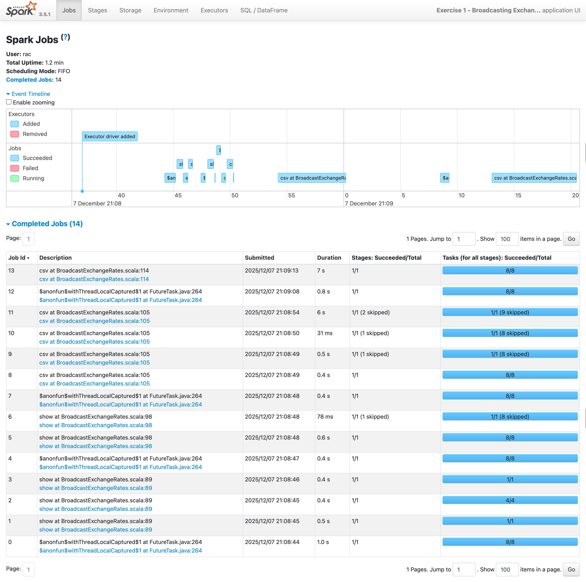

# **Exercise 1 – Broadcasting Exchange Rates Using Spark (Broadcast Join Approach)**

## **Overview**

This exercise demonstrates how to efficiently enrich a **large transactions dataset** using a **small exchange rates dataset** via **Spark broadcast join**, avoiding unnecessary shuffle.


1. Load transactions and exchange rate CSV files from S3
2. Broadcast the small dataset (exchange rates)
3. Convert individual transactions to USD
4. Count transactions per currency
5. Write both outputs back to S3

---

# **Input Sample Data**

## **1. Transactions Data (`transactions.csv`)**

| txn_id | amount | currency |
| ------ | ------ | -------- |
| 1001   | 500    | INR      |
| 1002   | 20     | EUR      |
| 1003   | 35     | USD      |
| 1004   | 10000  | JPY      |
| 1005   | 12     | EUR      |

Schema:

```text
txn_id: Long
amount: Double
currency: String
```

---

## **2. Exchange Rates Data (`exchange_rates.csv`)**

| currency | rate_to_usd |
| -------- | ----------- |
| USD      | 1.00        |
| EUR      | 1.07        |
| INR      | 0.012       |
| JPY      | 0.0068      |

Schema:

```text
currency: String
rate_to_usd: Double
```

---

# **S3 Directory Structure**

### **Input Directory Layout**

```
s3://sanjeev-scala-s3/
    transactions/
        transactions.csv
    exchange_rates/
        exchange_rates.csv
```

### **Output Structure (Created by Spark)**

```
s3://sanjeev-scala-s3/output/
    txns_per_currency_csv/
        part-0000.csv
        ...
    converted_transactions/
        part-0000.csv
        ...
```

### In `application.conf`, values map like:

```hocon
app {
  transactionsPath = "s3a://sanjeev-scala-s3/transactions/"
  exchangeRatesPath = "s3a://sanjeev-scala-s3/exchange_rates/"
  broadcastOutputPath = "s3a://sanjeev-scala-s3/output/txns_per_currency_csv/"
  broadcastConvertedOutputPath = "s3a://sanjeev-scala-s3/output/converted_transactions/"
}
```

---

# **What the Output Should Look Like**

## **A. Converted Dataset Output (`broadcast_converted`)**

Each row should include the USD-converted amount:

| txn_id | amount | currency | rate_to_usd | amount_usd |
| ------ | ------ | -------- | ----------- | ---------- |
| 1001   | 500    | INR      | 0.012       | 6.0        |
| 1002   | 20     | EUR      | 1.07        | 21.4       |
| 1003   | 35     | USD      | 1.00        | 35.0       |
| 1004   | 10000  | JPY      | 0.0068      | 68.0       |
| 1005   | 12     | EUR      | 1.07        | 12.84      |

---

## **B. Aggregated Output (`broadcast_agg`)**

Output after grouping by currency:

| currency | count |
| -------- | ----- |
| EUR      | 2     |
| INR      | 1     |
| USD      | 1     |
| JPY      | 1     |

---

# **Expected Output Summary**

| Output                | Description                                  |
| --------------------- | -------------------------------------------- |
| `broadcast_converted` | Full enriched dataset including `amount_usd` |
| `broadcast_agg`       | Count of transactions per currency           |
| Broadcast used?       | Yes (`broadcast(exchangeRates)`)             |
| Shuffle avoided?      | Yes – small table broadcasted                |

