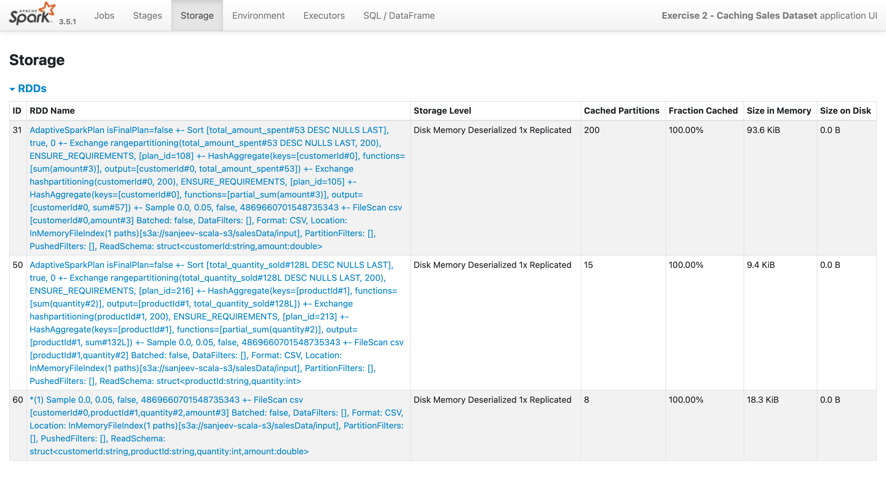
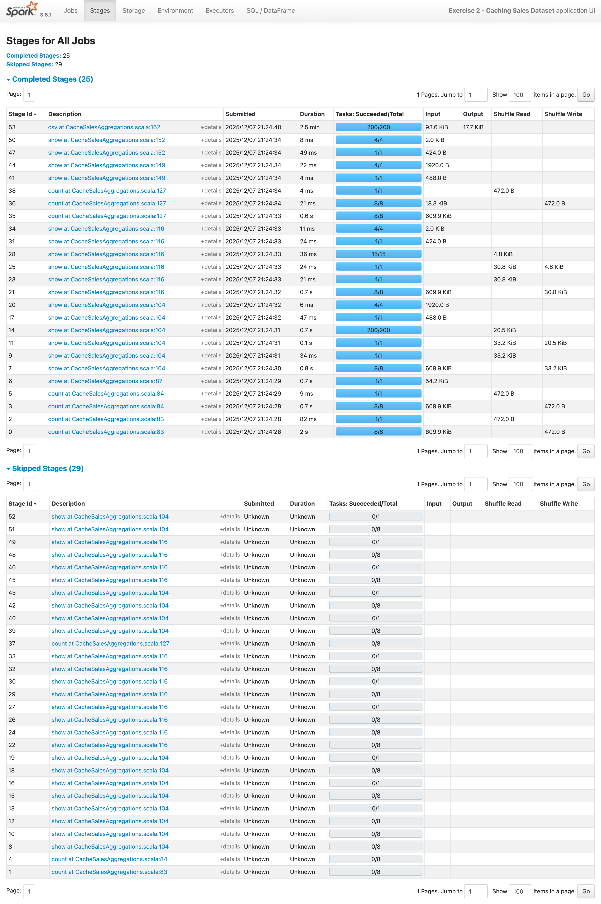
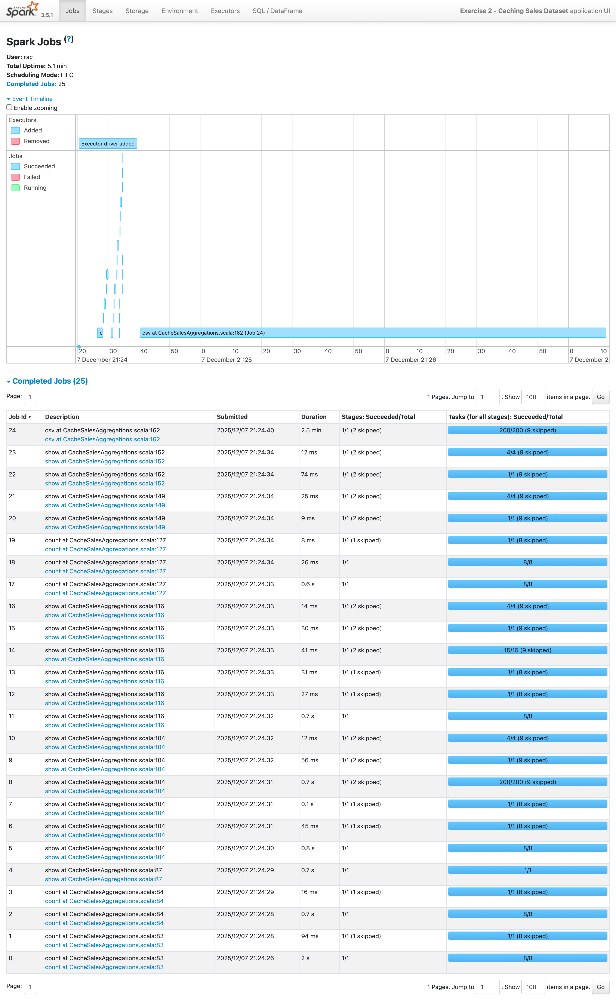

# **Exercise 2 – Caching Sales Dataset & Benchmarking Performance**

This exercise demonstrates how **Spark caching** can accelerate repeated computations on the same dataset.
We compare two scenarios:

1. Aggregations **without caching**
2. Aggregations **with caching**

We measure execution time for both approaches and write final aggregated results to S3.

---

# **Objective**

* Load a large sales dataset
* Sample 5% for demonstration
* Run aggregations *without* caching → measure time
* Cache the dataset
* Run aggregations *with* caching → measure time
* Compare performance
* Write output to S3

---

# **Input Sample Data**

### **sales.csv**

| customerId | productId | quantity | amount |
| ---------- | --------- | -------- | ------ |
| C001       | P10       | 2        | 500    |
| C002       | P12       | 1        | 120    |
| C001       | P11       | 4        | 900    |
| C003       | P14       | 3        | 250    |
| C002       | P10       | 5        | 1000   |

### Schema

```text
customerId: String
productId: String
quantity: Integer
amount: Double
```

---

# **S3 Directory Structure**

### **Input Directory Layout**

```
s3://sanjeev-scala-s3/
    salesData/
        sales.csv
```

### **Output Structure (Created by Spark)**

```
s3://sanjeev-scala-s3/output/
    customer_agg/
        part-0000.csv
        ...
    product_agg/
        part-0000.csv
        ...
```

### Sample `application.conf`

```hocon
app {
  salesInputPath        = "s3a://sanjeev-scala-s3/salesData/"
  customerAggOutputPath = "s3a://sanjeev-scala-s3/salesData/output/customer_agg/"
  productAggOutputPath  = "s3a://sanjeev-scala-s3/salesData/output/product_agg/"
}
```

---

# **What the Output Should Look Like**

## A. Customer Total Amount Aggregation

| customerId | total_amount_spent |
| ---------- | ------------------ |
| C001       | 1400               |
| C002       | 1120               |
| C003       | 250                |

---

## B. Product Total Quantity Aggregation

| productId | total_quantity_sold |
| --------- | ------------------- |
| P10       | 7                   |
| P11       | 4                   |
| P14       | 3                   |
| P12       | 1                   |

---

# **Explanation of Expected Behavior**

### **Without Cache**

Spark will:

* Read the dataset
* Recompute transformations each time
* Perform full scan for each aggregation
* Slowest execution

---

### **With Cache**

Spark will:

* Load the dataset *once*
* Store it in memory
* Reuse cached version for all aggregations
* Much faster repeated operations

---

# **Summary of the Exercise**

| Step         | Description                                             |
| ------------ | ------------------------------------------------------- |
| Load data    | Read large sales CSV from S3                            |
| Sampling     | Use 5% data for faster local testing                    |
| No Cache Run | Aggregations executed with full recomputation           |
| Cache Run    | Dataset stored in memory → Faster repeated aggregations |
| Output       | Aggregated results written to S3                        |

---

# **Performance Expectation**

| Scenario                       | Expected Time                          |
| ------------------------------ | -------------------------------------- |
| Without Cache                  | Slowest – Spark rescans data each time |
| With Cache                     | Faster – Data reused from memory       |
| With Cache + Optimized Cluster | Best performance                       |




