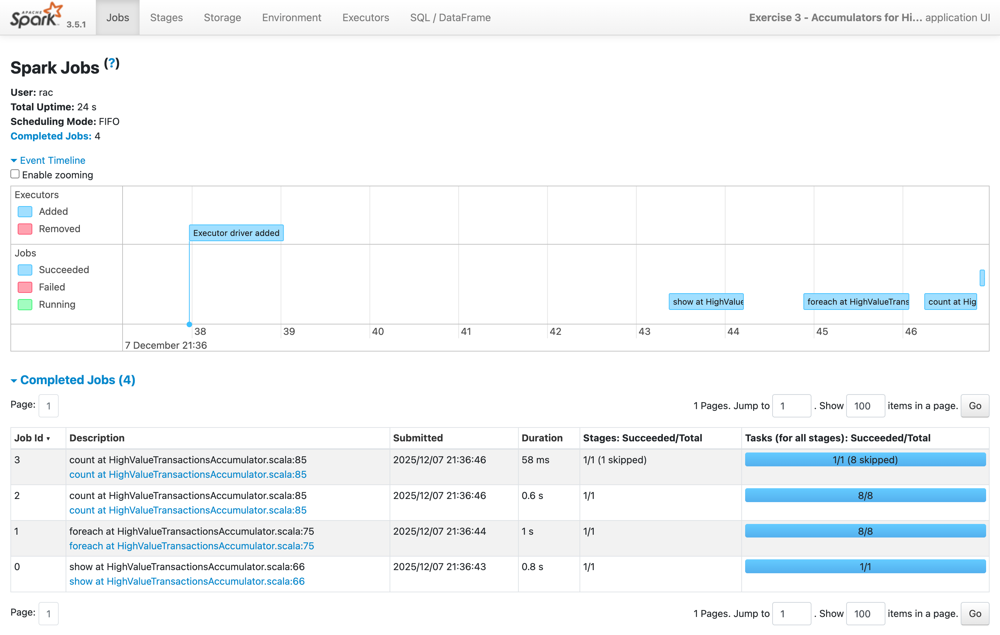
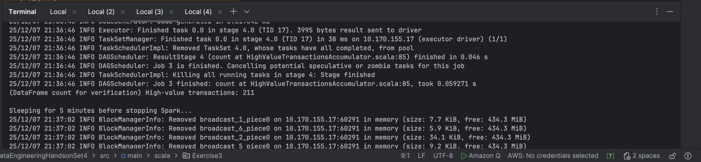
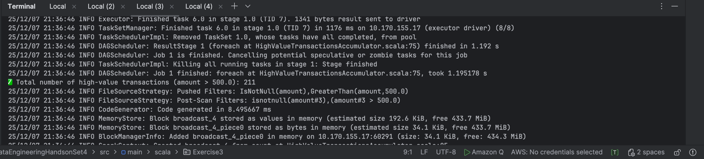

# **Exercise 3 – Using Accumulators to Count High-Value Transactions**

This exercise demonstrates the use of **Spark accumulators** to count events across distributed worker nodes.
In this example, we count how many transactions have an amount **greater than a threshold** (e.g., > 500 USD).

---

# **Objective**

* Load a sales transaction dataset from S3
* Create a Spark accumulator
* Process each transaction in parallel
* Update the accumulator when the transaction amount is “high value”
* Validate the accumulator result using a DataFrame count

---

# **Input Sample Data**

### **transactions.csv**

| customerId | productId | quantity | amount |
| ---------- | --------- | -------- | ------ |
| 101        | 10        | 2        | 300    |
| 102        | 12        | 1        | 520    |
| 103        | 14        | 4        | 1500   |
| 101        | 11        | 1        | 450    |
| 102        | 15        | 3        | 700    |

### Schema

```text
customerId: Integer
productId: Integer
quantity: Integer
amount: Double
```

### Threshold for high-value

```text
threshold = 500.0
```

Meaning any transaction where:

```
amount > 500.0
```

is considered high-value.

---

# **S3 Directory Structure**

### **Input Directory Layout**

```
s3://sanjeev-scala-s3/
    salesData/
        sales.csv
```

### Sample `application.conf`

```hocon
app {
  salesInputPath = "s3a://sanjeev-scala-s3/salesData/Input/"
}
```

---

# **Expected Output Explanation**

Given the sample data above:

| amount | > 500 ? |
| ------ | ------- |
| 300    | ❌       |
| 520    | ✔       |
| 1500   | ✔       |
| 450    | ❌       |
| 700    | ✔       |

### Therefore:

```
Expected Accumulator Count = 3
```

In addition:

* Spark prints the accumulator value
* A DataFrame filter count is used for validation

Example output:

```
Total number of high-value transactions (amount > 500.0): 3
(DataFrame count for verification) High-value transactions: 3
```
---

| Concept                     | Explanation                                                       |
| --------------------------- | ----------------------------------------------------------------- |
| **Accumulator**             | A distributed counter updated on executors and read on the driver |
| **foreach action**          | Executes row-by-row on executors (NOT lazily)                     |
| **Driver-side consistency** | Accumulator values are only reliable *after* an action completes  |
| **Cross-validation**        | You verify accumulator output via DataFrame `.count()`            |

---

# **Summary**

- Input: sales transactions dataset
- Accumulator counts `amount > threshold`
- Output: printed counts (accumulator + DataFrame verification)
- Accumulator is updated on executors & read on driver
- Demonstrates distributed counting pattern





