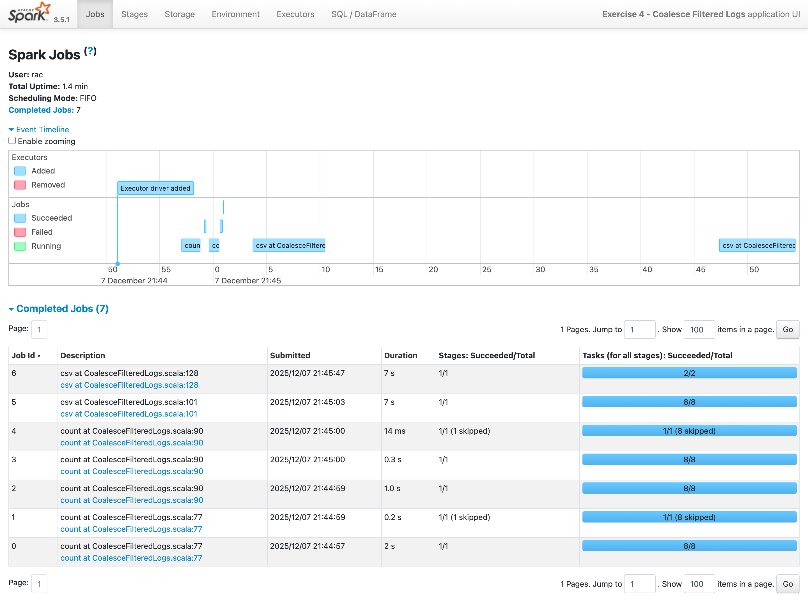
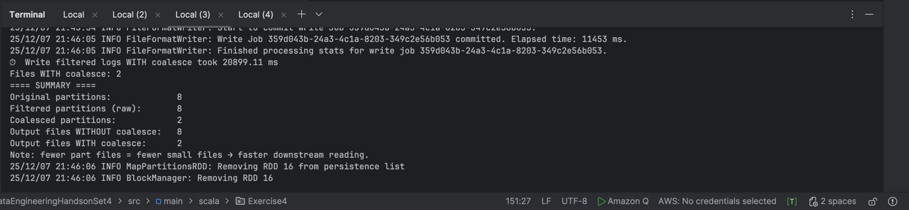

# **Exercise 4 – Coalescing Filtered Logs to Reduce Small Files**

This exercise demonstrates how to reduce the number of output files when writing filtered data to S3 by using **coalesce()**.

* Load logs from S3
* Filter for `"ERROR"` level logs
* Write output **without** coalesce → many part files
* Write output **with** coalesce → fewer part files
* Compare partition counts and output files
* Understand the impact of coalesce on performance

---

# **Objective**

1. Load raw logs dataset from S3
2. Filter out only `"ERROR"` level logs
3. Write the result **twice**:

    * without coalesce
    * with coalesce
4. Count output part-files from each write
5. Measure impact on partition reduction

---

# **Input Sample Data**

### **logs.csv**

| timestamp           | level | service        | message       |
| ------------------- | ----- | -------------- | ------------- |
| 2024-10-01 10:15:00 | INFO  | AuthService    | login success |
| 2024-10-01 10:20:11 | ERROR | BillingService | invalid card  |
| 2024-10-01 10:21:42 | WARN  | AuthService    | slow response |
| 2024-10-01 10:22:01 | ERROR | PaymentService | timeout       |
| 2024-10-01 10:25:10 | INFO  | OrderService   | order placed  |

### Schema

```text
timestamp: String
level: String
service: String
message: String
```

### Filter Condition

```text
Only rows where level = "ERROR"
```

---

# **S3 Directory Structure**

### **Input Directory Layout**

```
s3://sanjeev-scala-s3/
    logs/
    input/
    large_logs/
        logs.csv
```

### **Output Directory Layout (Created by Spark)**

```
s3://sanjeev-scala-s3/output/
    no_coalesce/
        part-0000.csv
        part-0001.csv
        ...
    with_coalesce/
        part-0000.csv
        part-0001.csv
        ...
```

### Example `application.conf`

```hocon
app {
  logsInputPath = "s3a://sanjeev-scala-s3/logs/input/large_logs/"
  logsFilteredNoCoalesceOutputPath = "s3a://sanjeev-scala-s3/logs/output/no_coalesce/"
  logsFilteredCoalesceOutputPath   = "s3a://sanjeev-scala-s3/logs/output/with_coalesce/"
}
```

---

# **Explanation of Expected Output**

### A. Filtering

Input:

| timestamp | level          | service      | message |
| --------- | -------------- | ------------ | ------- |
| INFO      | —              | —            | —       |
| **ERROR** | BillingService | invalid card |         |
| WARN      | —              | —            | —       |
| **ERROR** | PaymentService | timeout      |         |
| INFO      | —              | —            | —       |

Filtered Output:

| timestamp           | level | service        | message      |
| ------------------- | ----- | -------------- | ------------ |
| 2024-10-01 10:20:11 | ERROR | BillingService | invalid card |
| 2024-10-01 10:22:01 | ERROR | PaymentService | timeout      |

---

### B. Output **WITHOUT coalesce**

Spark will write as many output part files as there are partitions.

Example:

```
part-0000.csv
part-0001.csv
part-0002.csv
part-0003.csv
```

If you had 8 partitions, Spark writes 8 part files.

---

### ✔ C. Output **WITH coalesce**

Coalesce reduces partitions BEFORE writing the result.

Example:

```
part-0000.csv
```

This significantly reduces small files in S3 → improves downstream performance.

---

# **Summary of Expected Behavior**

| Step                | Result                                            |
| ------------------- | ------------------------------------------------- |
| Load logs           | DataFrame with partitions from source             |
| Filter ERROR        | Cached for multiple downstream use                |
| Write no coalesce   | Many part files (one per partition)               |
| Write with coalesce | Fewer part files (reduced partitions)             |
| Summary printed     | Shows partition reduction + file count difference |



