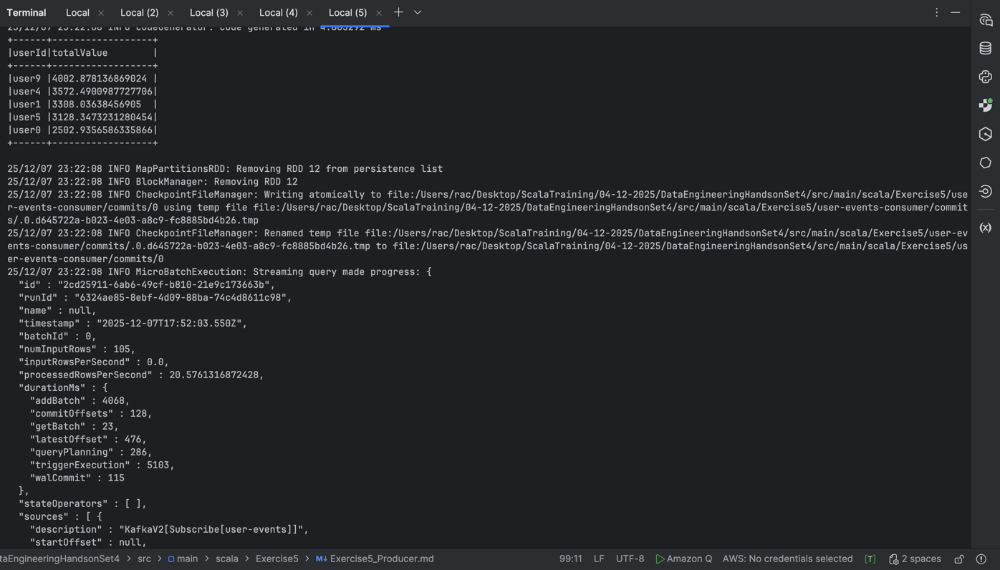

# Exercise 5 — Kafka + Protobuf + Spark Streaming

### *Producers + Consumers with Optimizations, Caching, and Batch Analytics*

---

## **1. Input: Sample Protobuf Data**

Your **user_event.proto**:

```proto
syntax = "proto3";

package protobuf;

message UserEvent {
  string userId = 1;
  string action = 2;
  double value  = 3;
}
```

Example logical events generated by the producer:

| userId | action   | value |
| ------ | -------- | ----- |
| user3  | click    | 22.5  |
| user7  | view     | 5.1   |
| user3  | purchase | 300.0 |
| user1  | signup   | 0.0   |
| user4  | logout   | 0.0   |

After compilation:

```bash
protoc --descriptor_set_out=UserEvent.desc \
       --include_imports \
       src/main/protobuf/user_event.proto
```

Spark uses:

```
descriptorFile = "UserEvent.desc"
messageType    = "protobuf.UserEvent"
```

Kafka stores the **raw binary protobuf bytes** (value) and the **userId** as the key.

---

## **2. What the Producer Sends**

Your optimized producer sends **50+ protobuf-serialized messages** to Kafka topic:

```
Topic: user-events
Key:   userId  (string)
Value: DynamicMessage serialized to protobuf binary
```

Example (human readable):

| Kafka Key | Kafka Value (UserEvent Protobuf)                   |
| --------- | -------------------------------------------------- |
| "user3"   | { userId:"user3", action:"click", value:55.2 }     |
| "user5"   | { userId:"user5", action:"purchase", value:320.9 } |

Real Kafka output (binary):

```
null    u1click$@
null    u2view@
```

This is normal because it’s **protobuf-encoded binary**, not JSON or CSV.

---

## **3. What the Consumer Reads**

Your Spark consumer performs:

### Step 1: Read Kafka as binary

```scala
val kafkaDF = spark.readStream
  .format("kafka")
  .option("subscribe", "user-events")
  .load()
  .select($"value")
```

---

## Step 2: Decode Protobuf

Using:

```scala
from_protobuf($"value".cast("BINARY"), messageType, descriptorFile)
```

Output schema becomes:

| userId | action   | value |
| ------ | -------- | ----- |
| user3  | click    | 22.5  |
| user1  | purchase | 110.0 |

Malformed protobuf records go to **malformed stream**.

---

## Step 3: Cache-per-batch Optimization

Inside `foreachBatch`:

```scala
val cached = batchDF.persist()
cached.count()
cached.show()
cached.unpersist()
```

Caching improves performance because the batch is scanned **three times**:

1. Show sample rows
2. Aggregate by action
3. Aggregate top users

---

## Step 4: Analytics Computed Each Batch

### **A. Events per action type**

```scala
cached.groupBy("action").count()
```

Sample output:

| action   | count |
| -------- | ----- |
| view     | 18    |
| click    | 12    |
| purchase | 8     |
| signup   | 7     |
| logout   | 5     |

---

### **B. Top 5 users by total value**

```scala
cached.groupBy("userId").agg(sum("value"))
```

Sample:

| userId | totalValue |
| ------ | ---------- |
| user4  | 890.2      |
| user2  | 720.1      |
| user1  | 655.0      |
| user7  | 440.5      |
| user3  | 320.0      |

---

## Stream Output Format (Console Logging)

```
================ BATCH 1 ================
Rows in this batch: 50
Sample rows:
+------+---------+-------+
|userId|action   |value  |
+------+---------+-------+
|user3 |click    |55.2   |
|user7 |view     |12.1   |
...

Events per action:
+---------+-----+
|action   |count|
+---------+-----+
|view     |18   |
|click    |12   |
...

Top 5 users by value:
+------+----------+
|userId|totalValue|
+------+----------+
|user4 |890.2     |
|user2 |720.1     |
...

```




