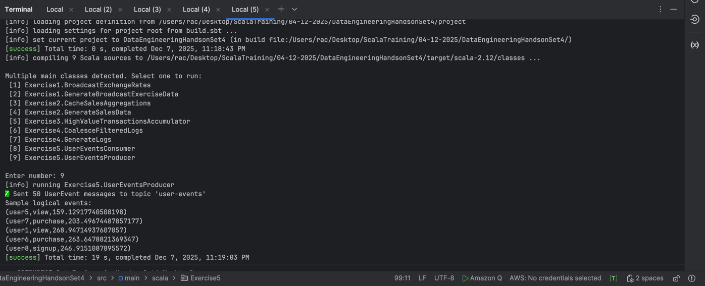

# **Exercise 5 – Kafka Protobuf Producer**

### *Protobuf → Kafka → Spark Streaming Pipeline*

---

# **Objective**

Create a Kafka producer that:

-  Generates **50+ random events**
- Serializes them using **Protobuf DynamicMessage**
- Sends the messages to Kafka topic **user-events**
- Uses **Kafka key = userId** for partition locality
- Optimizes throughput using batching, compression, and idempotence

This forms the input pipeline for Spark Structured Streaming in Exercise 5.

---

# **1. Input Sample Data**

Your producer generates **logical events** of the form:

```
(userId, action, value)
```

### Example of randomly generated events:

```text
(user3, view, 221.45)
(user1, click, 18.92)
(user5, purchase, 412.63)
(user9, signup, 289.12)
(user1, logout, 12.55)
```

These logical events are converted to **Protobuf binary** with the schema:

```proto
syntax = "proto3";
package protobuf;

message UserEvent {
  string userId = 1;
  string action = 2;
  double value  = 3;
}
```

The `.desc` descriptor file is used by both producer and consumer.

---

# **2. Description of What the Producer Does**

### ✔ Step 1 – Load `.desc` and Protobuf message type

The producer loads the descriptor and finds:

```
protobuf.UserEvent
```

This allows building DynamicMessage objects without generating `.java` classes.

---

### ✔ Step 2 – Generate 50+ random user events

* 10 unique userIds (`user0` to `user9`)
* 5 random actions
* Values between 0 and 500
  This simulates a realistic clickstream workload.

---

### ✔ Step 3 – Convert each event into Protobuf binary

A `DynamicMessage` is built using cached field descriptors:

```
userIdField
actionField
valueField
```

This improves performance by avoiding repeated lookup calls.

---

### ✔ Step 4 – Send to Kafka

Each message is sent with:

```
key = userId
value = protobuf bytes
```

Kafka partitioning strategy ensures:

* Same user always goes to the same partition
* Enables user-level aggregations in Spark

---

### ✔ Step 5 – Use optimized Kafka producer settings

| Setting                     | Purpose                                   |
| --------------------------- | ----------------------------------------- |
| `linger.ms = 20`            | Batch messages to reduce network overhead |
| `batch.size = 32 KB`        | Improves throughput                       |
| `compression = lz4`         | Smaller payloads → faster Kafka I/O       |
| `enable.idempotence = true` | Prevent duplicate messages                |
| `acks = all`                | Strong delivery guarantees                |

---

# **3. Expected Output**

### Kafka receives **binary Protobuf** data.

Although the console consumer shows unreadable hex:

```
user5   userpurchase(E???c@
```

Spark Structured Streaming will decode these correctly using:

```
from_protobuf(...)
```

### Expected Kafka topic characteristics:

| Property   | Value                        |
| ---------- | ---------------------------- |
| Topic name | `user-events`                |
| Partitions | Based on your Kafka config   |
| Key        | userId                       |
| Value      | Protobuf-encoded `UserEvent` |

---

# **4. Expected Output in Spark Consumer (Downstream)**

Although the producer only sends messages, these are the outputs expected once Spark consumes them:

### ✔ Events per action (example)

```
+---------+-------+
| action  | count |
+---------+-------+
| click   | 14    |
| view    | 11    |
| purchase| 10    |
| signup  |  8    |
| logout  |  7    |
+---------+-------+
```

### ✔ Top 5 users by total value (example)

```
+-------+-----------+
| userId| totalValue|
+-------+-----------+
| user3 | 1125.65   |
| user1 | 989.21    |
| user5 | 872.44    |
| user9 | 751.10    |
| user6 | 622.17    |
+-------+-----------+
```

Spark writes these outputs to S3 in **Protobuf format** per batch.

---

# **5. Summary**

| Component          | What It Does                                                                                |
| ------------------ | ------------------------------------------------------------------------------------------- |
| **Producer**       | Generates random events and sends them to Kafka in Protobuf format using optimized batching |
| **Kafka**          | Stores events partitioned by `userId`                                                       |
| **Spark Consumer** | Decodes Protobuf, aggregates events, writes output to S3 in Protobuf format                 |

This producer is ready for use in your full **Kafka → Spark → S3 analytics pipeline**.

